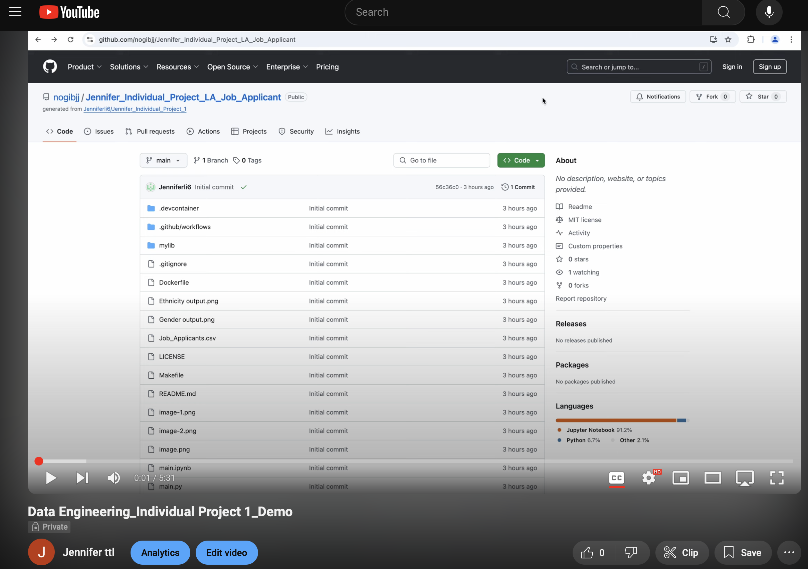
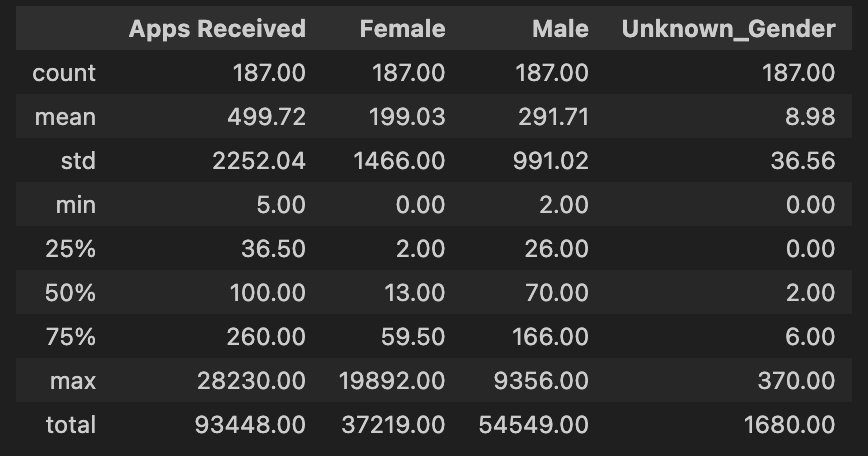
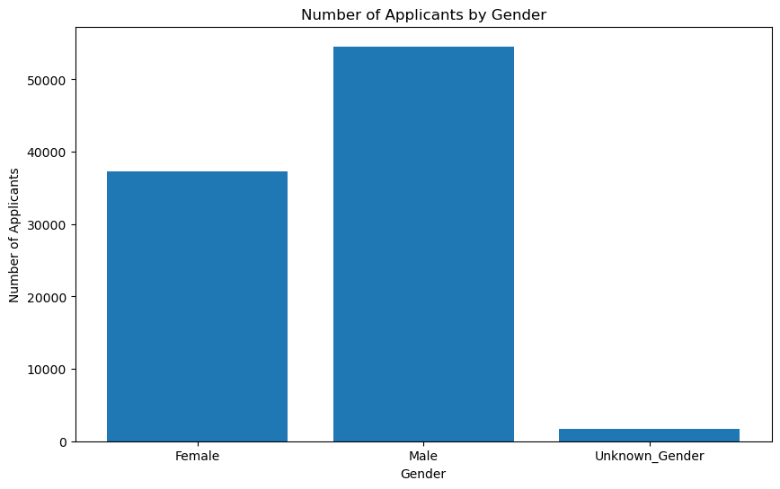
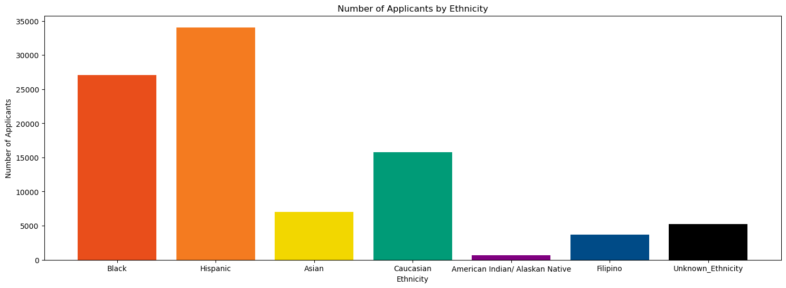

# Individual Project - LA Job Applicant Data Analysis 

## Youtube video

https://youtu.be/C9W8ITegp7c

## Project Introduction
The main purpose of this project is to use data science tools such as Pandas and Polars to analyze the job application data in City of LA, by gender and ethnicity, including generating summary statistics and visualized chart.

## Project Data Source
The data used in this analysis comes from a dataset published by data.lacity.org on Data.Gov website, and the data version is as of September 15, 2023. You can find more information about data source via link here: https://catalog.data.gov/dataset/job-applicants-by-gender-and-ethnicity 

## Continuous Integration
This project uses GitHub Actions for continuous integration, automatically running the following jobs:
- Installing dependencies
- Formatting code with Black
- Linting code with Ruff
- Running all tests (script, notebook, and library)

## Statistic Summary 

## Data Visualizations

## Conclusion
- There is a notable gender imbalance, with male applicants outnumbering female applicants by a considerable margin.
- Ethnicity distribution shows Hispanic and Black applicants as the largest groups, with significant representation from Caucasian applicants as well. Other ethnic groups have much smaller representation.
- These findings suggest potential areas for our future investigation, such as understanding the factors contributing to the gender imbalance in applicants, exploring ways to increase diversity in the applicant pool, etc.

## References
https://github.com/nogibjj/python-ruff-template

